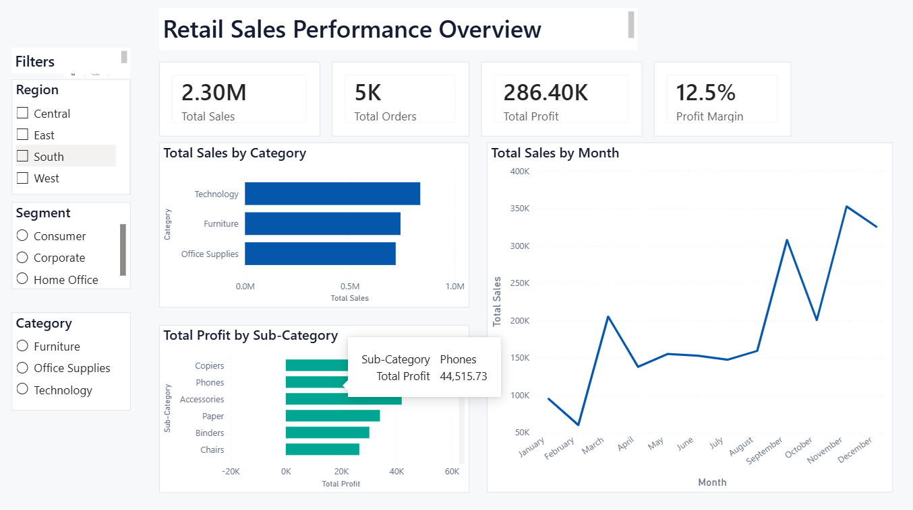

# Retail Sales Performance Dashboard

## Project Overview

This project analyzes retail sales performance using the Superstore dataset.

The dashboard was built in Power BI to identify:

- Sales trends over time
- Product category performance
- Profitability by sub-category
- Customer segment behavior
- Regional sales performance

---

## Tools Used

- Power BI
- DAX
- Excel
- Data Cleaning
- Business Analytics

---

## Dashboard Preview

---

## Key Metrics

| Metric | Value |
|----------|----------|
| Total Sales | $2.30M |
| Total Profit | $286K |
| Total Orders | 5K |
| Profit Margin | 12.5% |

---

## Key Insights

### Sales Performance

- Technology generated the highest sales revenue
- Furniture produced lower profitability despite strong sales

### Product Profitability

- Copiers were the most profitable sub-category
- Several product groups generated significantly lower margins

### Seasonal Trends

- Sales peaked during Q4
- November produced the strongest monthly performance

---

## Dashboard Features

- Interactive filters for Region
- Customer Segment filtering
- Category filtering
- Monthly sales trend analysis
- Profitability analysis by sub-category

---

## Files

| File | Description |
|--------|--------|
| Retail_Sales_Dashboard.pbix | Power BI project |
| Sample-Superstore.csv | Source dataset |
| dashboard-overview.png | Dashboard screenshot |

---

## Author

Aspiring Data Analyst

Built as a portfolio project demonstrating:

- Data Visualization
- Business Intelligence
- Dashboard Design
- Data Analysis
